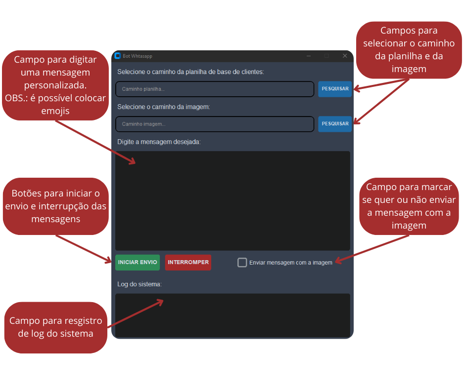

# 🤖 Bot para Envio de Mensagens no WhatsApp
Automatize o envio de mensagens no WhatsApp com um bot simples e eficiente. Ideal para campanhas de marketing, lembretes e comunicação em massa.

## 📖 Sobre o Projeto
Este projeto é uma aplicação desktop desenvolvida em **Python** que utiliza o **customTKinter** para criar uma interface gráfica, permitindo o envio automatizado de mensagens personalizadas no **WhatsApp Web** a partir de uma lista de contatos armazenada em uma planilha do Excel. Além disso, conta com suporte para anexos de imagens, possibilitando enviar sua mensagem acompanhada de uma imagem, de acordo com sua escolha.

## 🚀 Tecnologias Utilizadas
- [Python 3](https://www.python.org/)
- [customTKinter](https://github.com/TomSchimansky/CustomTkinter) (para a interface gráfica)
- [openpyxl](https://openpyxl.readthedocs.io/en/stable/) (para manipulação de planilhas Excel)
- [selenium](https://www.selenium.dev/) (para o envio das mensagens no WhatsApp Web)

## ⚙️ Como Instalar e Rodar o Projeto

### Pré-requisitos
Certifique-se de ter o **Python 3** instalado em sua máquina.

Tenha uma **planilha Excel** com sua base de contatos salvos. Essa planilha precisa estar no seguinte padrão:


É possível acrescentar vários contatos nessa base, contanto que a planilha esteja nesse padrão. Caso tenha dúvidas em como organizar a planilha, utilize a [planilha base](Planilha_Base/Planilha_Base.xlsx).

### Passo a Passo
1. **Clone o repositório:**
   ```bash
   git clone https://github.com/paulo-victor-dev/Bot-Envio-Mensagens-Whatsapp.git
   ```
2. **Entre na pasta do projeto:**
   ```bash
   cd Bot-Envio-Mensagens-Whatsapp
   ```
3. **Crie um ambiente virtual (opcional, mas recomendado):**
   ```bash
   python -m venv venv
   
   # No Windows:
   venv\Scripts\activate
   
   # No Linux/macOS:
   source venv/bin/activate
   ```
4. **Instale as dependências:**
   ```bash
   pip install -r requirements.txt
   ```
5. **Execute o projeto:**
   ```bash
   python main.py
   ```

## 🛠 Funcionalidades
✔️ Seleção de planilha de contatos  
✔️ Escolha de imagens para envio  
✔️ Digitação e envio de mensagens personalizadas  
✔️ Log de sistema para monitoramento  
✔️ Interface intuitiva em modo escuro  

## 📸 Demonstração
<p align="center"><i>Interface da Aplicação</i></p>

<p align="center">
  
</p>

<p align="center"><i>Exemplo de envio de mensagem</i></p>

<p align="center">
  
</p>
Conforme mostra o exemplo, é possível substituir palavras na mensagem pelo nome do contato e do vendedor que está na planilha. Basta escrever "CONTATO" (tudo maiúsculo) para o nome do contato e "VENDEDOR" (tudo maiúsculo) para o nome do vendedor. Caso não tenha nenhuma dessas informações, ou não as queira colocar, pode enviar a mensagem normalmente. 

## 📩 Contato
📧 Email: vikktor.paulo@gmail.com  
🔗 [LinkedIn](https://www.linkedin.com/in/paulo-rocha-dev/)
